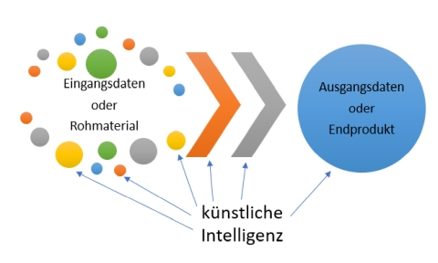
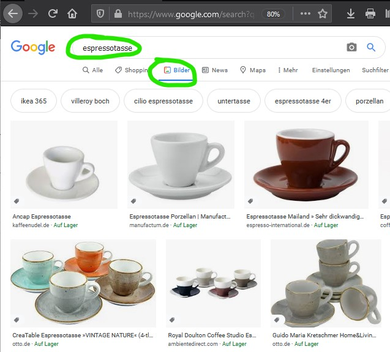

Autor:  Andreas Traut  
Datum: 06.08.2020  
[Download als PDF](https://github.com/AndreasTraut/Deep_learning_explorations/raw/master/Aehnliche_Bilder_finden.pdf)  

# Gruppieren ähnlicher Dinge

Ich habe [hier](https://github.com/AndreasTraut/Arbeitsproben/blob/master/Anwendungsf%C3%A4lle%20der%20KI%20in%20der%20Industrie.md) einige ["Anwendungsfälle der künstlichen Intelligenz in der Industrie"](https://github.com/AndreasTraut/Arbeitsproben/blob/master/Anwendungsf%C3%A4lle%20der%20KI%20in%20der%20Industrie.md) beschrieben und dabei das folgende Schaubild verwendet: 

 

Als Anwendungsfälle der künstlichen Intelligenz (KI) in der Industrie habe ich dabei *Absatzprognosen*, *automatische Bestellungen*, *Produktentwicklung* und die *Qualitätskontrolle* genannt. Die KI sollte dabei **Zusammenhänge** zwischen den Eingangsdaten/dem Rohmaterial und den Ausgangsdaten/dem Endprodukt verstehen und vorhersagen können. Beispielsweise sollte die KI vorhersagen können, was sich an den Ausgangsdaten/dem Endprodukt verändern würde, wenn sich an den Eingangsdaten/dem Rohmaterial etwas verändert hat. 

Ein weiteres Problem, das häufig vorkommt, ist das **Gruppieren von ähnlichen Dingen**. Wir kennen die nützliche Google-Funktion, mit der sich ähnliche Bilder anzeigen lassen. Man gibt einen Begriff (z.B. Espressotasse) ein und bekommt ähnliche Bilder angezeigt: 

Warum ist das interessant? Angenommen wir haben ein Bild, über das wir noch nicht viel wissen und welches wir in eine uns bekannte Gruppierung einordnen möchten. Beispielweise ein Röntgenbild. Oder ein Bild einer Pflanze. Das Gruppieren von ähnlichen Dingen spielt aber auch an vielen anderen Bereichen eine Rolle und muss auch nicht zwingend mit Bildern zu tun haben. Nehmen wir einen Text oder ein Musikstück: auch diese können gruppiert werden. 

<u>Die erste Frage ist dabei:</u> 
Wie vergleicht man zwei Bilder miteinander? Oder zwei Texte? Das ist nicht einfach, aber dieses Problem schon vielfach analysiert worden und es gibt Vorgehensweise, die man nur kopieren muss. 

<u>Die zweite Frage ist:</u> 
Wie geht man vor, um alle Dinge (Bilder oder Texte) **paarweise** miteinander zu vergleichen? Nehmen wir 1 Million Dinge, die wir paarweise miteinander vergleichen um damit die Gruppen bilden zu können. Dann haben wir schon 1 Million mal 999 999 / 2, also etwa 500 Milliarden Rechenoperationen. Das kann sehr lange dauern. Hier kommen dann Big-Data Vorgehensweisen zum Einsatz. Eine davon ist das [**"Local-Sensitive-Hashing (LSH)"**](README.md), das ich hier kurz vorstellen möchte. LSH ist eine Technik, um ähnliche Dinge mit einer **hohen Wahrscheinlichkeit** in Gruppen einzuteilen. Man verzichtet also auf absolut exakte Ergebnisse und nimmt eine kleine Fehlerwahrscheinlichkeit in Kauf. Diese Wahrscheinlichkeit kann mit Steuerungsparametern eingestellt werden (je nach Bedarf).  Sind diese Parameter einmal eingestellt, kann der KI-Algorithmus sehr schnell neue Bilder in Gruppen einordnen. Der Vorteil, auf eine absolut exakte 100%-ige Gruppierung zu verzichten liegt auf der Hand: LSH geht viel schneller, als 100% exakte Algorithmen. Für Programmierer, die gerne etwas tiefer in die Materie einsteigen möchten, habe ich [hier](README.md) meine Erfahrungen mit dem LSH dokumentiert. 

Das Ergebnis meiner Arbeit war: ich habe auf über 9000 Bilder (je etwa 300*300 pixel) den LSH Algorithmus angewendet. Unter anderem auch meine Sammlung an Kirchenfenstern, Uhren und Espressotassen (ich trinke gerne Espresso und habe irgendwann angefangen, die Tassen zu fotografieren). Auf meinem eigenen Computer hat diese Gruppierung ein paar Minuten gedauert und war nur einmalig notwendig.

Danach habe ich ein völlig neues Bild einer Espressotasse aus dem Internet heruntergeladen: 

Dieses Bild habe ich dem Programm gegeben und damit dann ähnliche Bilder aus meiner Bildersammlung suchen lassen. Nach wenigen Sekunden hat mir das Programm dann diese 15 Bilder angezeigt: 

Auch für eine größere Menge (z.B. für diese 63 Bilder) hat das Programm nur wenige Sekunden gebraucht: 

Dasselbe habe ich dann auch für meine Kirchenfenster Bilder getestet: 

Wer einen kurzen Blick auf die [Programmzeilen](https://github.com/AndreasTraut/Deep_learning_explorations/blob/master/8_Image_similarity_search/Beispiel_aehnliche_Bilder_finden.ipynb) werfen möchte, die hierfür nötig sind, kann das gerne [hier](https://github.com/AndreasTraut/Deep_learning_explorations/blob/master/8_Image_similarity_search/Beispiel_aehnliche_Bilder_finden.ipynb) tun. Keine Angst: es sind wirklich nur ein paar wenige Codezeilen und ich betone das hier aus einem guten Grund: die Technik hinter diesen KI-Algorithmen ist äußerst komplex und umfangreich. <u>Aber</u> die Anwendung ist nicht allzu kompliziert! In diesem Fall könnte ein beliebiger Mitarbeiter diesen Code zum Finden ähnlicher Objekte starten und mit den angezeigten Ergebnissen weiterarbeiten. Es ist nicht notwendig für diesen Mitarbeiter den Programmcode im Detail zu verstehen! Also zögern Sie nicht, sich einen kurzen Eindruck zum [Programmcode](https://github.com/AndreasTraut/Deep_learning_explorations/blob/master/8_Image_similarity_search/Beispiel_aehnliche_Bilder_finden.ipynb) verschaffen.

Und für diejenigen, denen dieser kurze Eindruck noch nicht genügt, habe ich [hier](README.md) ausführlich die Materie zum [**"Local-Sensitive-Hashing (LSH)"**](README.md) dokumentiert. Viel Spaß beim Lesen uns Ausprobieren. 

Vertieft habe ich das Thema dann in [diesem Verzeichnis](https://github.com/AndreasTraut/Deep-Learning). 

---

# MIT License

Copyright (c) 2020 Andras Traut

Permission is hereby granted, free of charge, to any person obtaining a copy
of this software and associated documentation files (the "Software"), to deal
in the Software without restriction, including without limitation the rights
to use, copy, modify, merge, publish, distribute, sublicense, and/or sell
copies of the Software, and to permit persons to whom the Software is
furnished to do so, subject to the following conditions:

The above copyright notice and this permission notice shall be included in all
copies or substantial portions of the Software.

THE SOFTWARE IS PROVIDED "AS IS", WITHOUT WARRANTY OF ANY KIND, EXPRESS OR
IMPLIED, INCLUDING BUT NOT LIMITED TO THE WARRANTIES OF MERCHANTABILITY,
FITNESS FOR A PARTICULAR PURPOSE AND NONINFRINGEMENT. IN NO EVENT SHALL THE
AUTHORS OR COPYRIGHT HOLDERS BE LIABLE FOR ANY CLAIM, DAMAGES OR OTHER
LIABILITY, WHETHER IN AN ACTION OF CONTRACT, TORT OR OTHERWISE, ARISING FROM,
OUT OF OR IN CONNECTION WITH THE SOFTWARE OR THE USE OR OTHER DEALINGS IN THE
SOFTWARE.