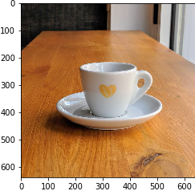
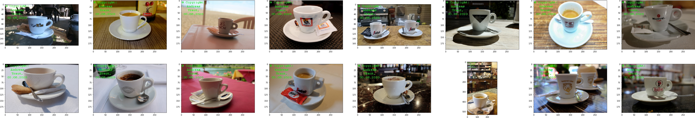
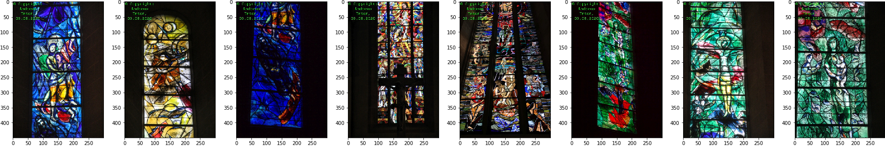

Autor:  Andreas Traut  
Datum: 06.08.2020  
[Download als PDF](https://github.com/AndreasTraut/Deep_learning_explorations/raw/master/README.pdf)  

# Local-Sensitive-Hashing (LSH)

##### What is the aim of my repository?

In this repository my aim was to better understand the ["Local-Sensitive-Hashing (LSH)"-Algorithm](https://en.wikipedia.org/wiki/Locality-sensitive_hashing) and apply it on my own dataset of pictures. I used one of the Notebooks from [Aayush Agrawal](https://github.com/aayushmnit) as a starting point and amended it according to my needs. 

Later I expanded my experiments on deep-learning, which I documented [here](https://github.com/AndreasTraut/Deep-Learning).

##### What is Local-Sensitive-Hashing?

Local-Sensitive-Hashing is a technique that puts similar input items in the same "buckets" **with a high probability**. You might want to ask: why should I apply an algorithm, which only works with a "high probabilty" instead of a 100%-probability? The answer is, that the Local-Sensitive-Hashing is "cheaper" (related to calculation time) and therefore works better on "Big Data" problems: whereas other 100% accurate algorithms take a lot of time, the LSH-algorithm is a lot quicker. The disadvantage of the LSH algorithm is that it creates "false positives", that is: pairs of items, that are similar, but these are not classified as such by the LSH algorithm. But there are some parameters (as described below), which help to adjust the "high probabilty" accordingly. 

##### Extending the "Caltech-101" dataset

The "Caltech-101" is a fixed dataset of images, which can be downloaded from [here](http://www.vision.caltech.edu/Image_Datasets/Caltech101/). It has 101 different classes of images (e.g. planes, cars,...) and this dataset has been used very often for analysing the performance of image classification models. Therefore importing it is very easy. In tensorflow you would only need one line to load the training data: 

```python
ds, ds_info = tfds.load('caltech101', split='train', shuffle_files=True)
```

As this seemed a bit too easy for me, my first aim was to to extend the original [Caltech-101 dataset](http://www.vision.caltech.edu/Image_Datasets/Caltech101/) and adding further classes of images. Therefore I added 122 additional pictures of my own picture library. I uploaded my new image dataset [here](./data/caltechown). These were from the four categories: 

1. espresso cups: 87 pictures, which will be assigned to the new group number 102
2. clocks: 10 pictures ->  group number 103
3. church windows: 4 pictures -> group number 104
4. foot: 21 pictures -> group number 105

I named my new dataset *"CaltechOwn"* (*"Caltech101+4"* of *"Caltech-105"* would also have been good names, because I added four new groups to the 101 existing groups). Obviously the importing of this new image dataset "CaltechOwn" would be a bit different to the simple `tfds.load` as show above. See [here](https://github.com/AndreasTraut/Deep_learning_explorations/blob/master/8_Image_similarity_search/Image%20similarity%20on%20Caltech101%20using%20FastAI%2C%20Pytorch%20and%20Locality%20Sensitive%20Hashing_amendedTraut.ipynb) how these images can be imported by using `ImageList.from_folder(path)`. My aim was also to see, if my exemplary pictures are good enough for defining new groups of image classes. I realized, that the answer was "yes": my own pictures formed new groups of images.

##### Applying ResNet-34 model

The next steps were a bit similar to what has been done in the original repository and I will explain it in more detail at the end of this article (see (*) below). In a few words: I installed [Fast-AI](http://docs.fast.ai/) and [Pytorch](https://pytorch.org/) and created a new model (using *"ResNet-34"*). Then I verified if the learning rate is still ok (even with my four new categories) and added the [ClassConfusion-Widget](https://docs.fast.ai/widgets.class_confusion.html) to examine the data (training data, verification data and test data). 

##### Applying Local-Sensitive-Hashing algorithm

Then I used the [LShash3](https://pypi.org/project/lshash3/) package in order to create LSH hashing and saved the results (see lsh.p and feature_dict.p). The parameters for the LSH are: 

- **hash size** k. This is the length of the resulting binary hash. 
- **number of tables** L. This is an optional parameter for multiple lookups. 
- **dimension of feature vector** d. This is the dimension of the input vector. 

I used k=10, L=5 and d=512, but also tried different combinations of (k,L,d). 

##### Add function "*get_similar_item_vect*"

Next I added a new function in the Jupyter-Notebook, named "*get_similar_item_vect*", in order to analyse totally new pictures (and not only already existing ones as in the original Jupyter-Notebook), similar to what has been done in a separate ".py" Script. I wanted to be able to run everything from the Jupyter-Notebook, which seemed to be more feasable than the original ".py"-Script. See [here](https://github.com/AndreasTraut/Deep_learning_explorations/blob/master/8_Image_similarity_search/Example%20own%20pictures.ipynb). 

### Results: 

The results are as follows: 

##### Testpicture 1: 



The LSH algorithm found these similar results: 



Even if the testpicture was totally new to the programm, it found my espresso cups. When I saw this the first time, I was happy, that my new espresso cup pictures seemed to be good enough to be an extension to the Caltech-101 dataset. And there are no "false positive" in the results. Therefore the LSH algorithm did a good job. 

##### Testpicture 2: 


Similar results: 


Something in this testpicture seems to be different to the first testpicuture. The proposed similar results are mainly from the Caltech-101 dataset and not from my own additional pictures. This is still fine, but I would have expected, that my own espresso cup pictures would be shown. I think the reason is the background of the picutres: these here have mostly a "one-coloured-background" wheras my espresso cup pictures have differents background (of tables and other things). 

##### Testpicture 3: 


Similar results: 


As I only had a four pictures of church clocks, I thought it would be interesting to see, what happened if I request 15 similar pictures. These are the results (most of them have some kind of circle in them). I would say, that the picture with the interior of the car is a "false positive". 

##### Testpicture 4: 


Similar results: Here the LSH algorithm also worked very well but the reason might also be, that these church windows are very unique and special and therefore it is easier for the LSH algorithm to distinguish them from from other pictures. 




### (*) Explanation on how ResNet-34 has been applied

There are differents layers in a model and they serve differents aims. The initial layers are mostly for understanding low-level features and these layers should find e.g. curves, shapes, lines, patterns or shapes. The next layers capture high-level features, like the shape of an espresso cup. 

When you load a model from fastAI it will by default have all layers frozen with pre-trained weights. In other libraries you would need to freeze them, e.g. by using the command `learn.freeze()`. Freezing prevents, that well trained models, like the *"ResNet34"*, from being modified: gradients are not calculated for these layers. 

In the fastAI library the command `learn.fit_one_cycle(2)` trains only the last layer and all other layers are kept frozen. Afterwards in order to make all layers trainable the command `learn.unfreeze()` is used and all weights can get updated from the pre-trained state according to the chosen loss function. So we don't start from scatch on these layers: we start from a pre-trained point. 

This technique is called **"transfer learning"**: we want *"to use the knowledge gained from other models and use it for solving different but related problems"* (see [here](https://en.wikipedia.org/wiki/Transfer_learning)).

We will see in my examples [here](https://github.com/AndreasTraut/Deep-Learning), how transfer learning improved the accuracy. 


---

# MIT License

Copyright (c) 2020 Andras Traut

Permission is hereby granted, free of charge, to any person obtaining a copy
of this software and associated documentation files (the "Software"), to deal
in the Software without restriction, including without limitation the rights
to use, copy, modify, merge, publish, distribute, sublicense, and/or sell
copies of the Software, and to permit persons to whom the Software is
furnished to do so, subject to the following conditions:

The above copyright notice and this permission notice shall be included in all
copies or substantial portions of the Software.

THE SOFTWARE IS PROVIDED "AS IS", WITHOUT WARRANTY OF ANY KIND, EXPRESS OR
IMPLIED, INCLUDING BUT NOT LIMITED TO THE WARRANTIES OF MERCHANTABILITY,
FITNESS FOR A PARTICULAR PURPOSE AND NONINFRINGEMENT. IN NO EVENT SHALL THE
AUTHORS OR COPYRIGHT HOLDERS BE LIABLE FOR ANY CLAIM, DAMAGES OR OTHER
LIABILITY, WHETHER IN AN ACTION OF CONTRACT, TORT OR OTHERWISE, ARISING FROM,
OUT OF OR IN CONNECTION WITH THE SOFTWARE OR THE USE OR OTHER DEALINGS IN THE
SOFTWARE.